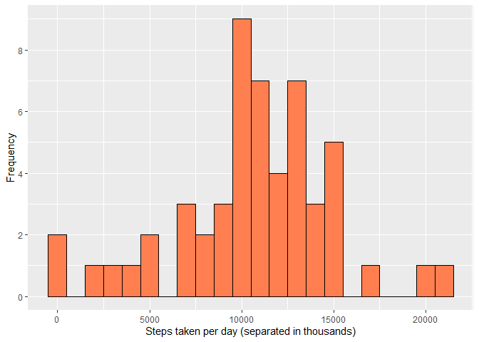
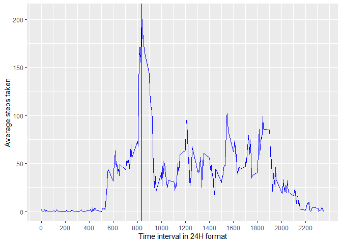
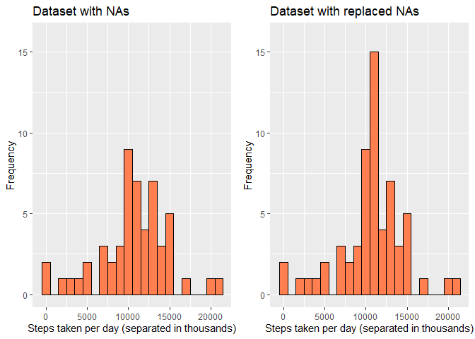
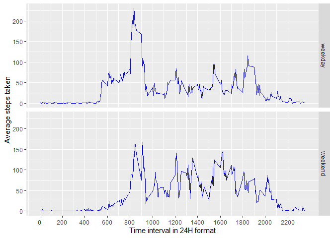

Welcome to my assignment report!

### Loading and preprocessing the data

Firstly, we will unzip and load the data to a data frame.


```r
unzip("activity.zip")
df <- read.csv("activity.csv")
```

Before the rest of analysis is conducted, it is good to check on how the data looks like in the data frame and its structure, with below.


```r
head(df)
```

```
##   steps       date interval
## 1    NA 2012-10-01        0
## 2    NA 2012-10-01        5
## 3    NA 2012-10-01       10
## 4    NA 2012-10-01       15
## 5    NA 2012-10-01       20
## 6    NA 2012-10-01       25
```

```r
str(df)
```

```
## 'data.frame':	17568 obs. of  3 variables:
##  $ steps   : int  NA NA NA NA NA NA NA NA NA NA ...
##  $ date    : chr  "2012-10-01" "2012-10-01" "2012-10-01" "2012-10-01" ...
##  $ interval: int  0 5 10 15 20 25 30 35 40 45 ...
```

Notice that the date is in type "chr". We try to transform the date column into Date object first so we will have an easier time dealing with it later on. 

I will be using dplyr package for this.


```r
library(dplyr)
df <- df %>%
        mutate(date = as.Date(date))

str(df)
```

```
## 'data.frame':	17568 obs. of  3 variables:
##  $ steps   : int  NA NA NA NA NA NA NA NA NA NA ...
##  $ date    : Date, format: "2012-10-01" "2012-10-01" ...
##  $ interval: int  0 5 10 15 20 25 30 35 40 45 ...
```

---

### What is mean total number of steps taken per day?

To answer this question, firstly the rows with NAs in the steps column are filtered away.


```r
df_no_na <- df %>%
        filter(!is.na(steps))
```

After that, we use melt and dcast function to summarize the sum of the data


```r
library(reshape2)
df_no_na_melt <- melt(df_no_na, id = "date", measure.vars = "steps")
result_steps_sum <- dcast(df_no_na_melt, date ~ variable,sum)
```

Below is the visualization of the result in histogram

```r
library(ggplot2)
ggplot(result_steps_sum, aes(steps)) + 
  geom_histogram(color = "black", fill = "coral", binwidth = 1000) +
  scale_y_continuous(breaks = 0:5 * 2) +
  xlab("Steps taken per day (separated in thousands)") +
  ylab("Frequency")
```

<!-- -->

The mean and median of the steps taken in everyday is as below. One thing to note that mean is very close to median.

```r
summary(result_steps_sum$steps)
```

```
##    Min. 1st Qu.  Median    Mean 3rd Qu.    Max. 
##      41    8841   10765   10766   13294   21194
```

---

### What is the average daily activity pattern?
Now, we are interested to find the average number of steps taken in each interval of the day. To do that, we have to melt another data frame that is based on the interval  


```r
library(reshape2)
df_interval_melt <- melt(df_no_na, id = "interval", measure.vars = "steps")
result_interval_mean <- dcast(df_interval_melt, interval ~ variable,mean)
```

Plotting the data as a time series.


```r
max_step_interval <- filter(result_interval_mean, steps == max(steps))$interval

ggplot(result_interval_mean, aes(interval, steps, group = 1)) +
  geom_line(color = "blue") + 
  geom_vline(xintercept = max_step_interval, color = "black") +
  scale_x_continuous(breaks = result_interval_mean$interval[(0:12 * 24) + 1]) +
  xlab("Time interval in 24H format") +
  ylab("Average steps taken")
```

<!-- -->

From the graph, the horizontal line denotes the interval with highest average steps. Seems to be sightly more of interval 800, which (I think) is around 8.20am.

---

### Imputing missing values
Firstly, we check on the number of missing values, and the proportion to all observation in the original df

```r
sum(is.na(df$steps))
```

```
## [1] 2304
```

```r
mean(is.na(df$steps))
```

```
## [1] 0.1311475
```
2304 of the rows is having steps variable as 'NA'. Recall that interval is actually 5 minutes interval, it means that there will be `24 * 60 / 5` = 288 intervals. Using `2304 / 288` then will result in 8. This suggest that there are 8 days with all missing values.

To include the NA days in, I will replace the intervals with NA, with the means of interval in other days. The mean is computed previously in `df_interval_melt`

The new dataset will be stored in `df_all`


```r
df_all <- df %>%
   mutate(steps = ifelse(is.na(steps), 
                        filter(result_interval_mean, interval == interval)$steps,
                        steps))

## Check result of mutation, as first few row of the original df has NA steps.
head(df_all)
```

```
##       steps       date interval
## 1 1.7169811 2012-10-01        0
## 2 0.3396226 2012-10-01        5
## 3 0.1320755 2012-10-01       10
## 4 0.1509434 2012-10-01       15
## 5 0.0754717 2012-10-01       20
## 6 2.0943396 2012-10-01       25
```

Now, I will recalculate the total steps of the interval based on this new dataset,  re-plot the histogram as the previous part of the assignment to check for differences.


```r
library(gridExtra) # Package required to display plot side by side for ggplot

df_all_melt <- melt(df_all, id = "date", measure.vars = "steps")
result2_steps_sum <- dcast(df_all_melt, date ~ variable,sum)

## Previous plot
plot1 <- ggplot(result_steps_sum, aes(steps)) + 
            geom_histogram(color = "black", fill = "coral", binwidth = 1000) +
            ylim(0, 16) +
            xlab("Steps taken per day (separated in thousands)") +
            ylab("Frequency") +
            ggtitle("Dataset with NAs")

## Plot with NA values replaced
plot2<- ggplot(result2_steps_sum, aes(steps)) + 
            geom_histogram(color = "black", fill = "coral", binwidth = 1000) +
            ylim(0, 16) +
            xlab("Steps taken per day (separated in thousands)") +
            ylab("Frequency") +
            ggtitle("Dataset with replaced NAs")

grid.arrange(plot1, plot2, ncol=2)
```

<!-- -->

And the comparison of mean and median


```r
summary(result_steps_sum$steps)
```

```
##    Min. 1st Qu.  Median    Mean 3rd Qu.    Max. 
##      41    8841   10765   10766   13294   21194
```

```r
summary(result2_steps_sum$steps)
```

```
##    Min. 1st Qu.  Median    Mean 3rd Qu.    Max. 
##      41    9819   10766   10766   12811   21194
```
The impact of this strategy is it will distort the frequency count of the steps taken and subsequently the quartile information, but no effect on the mean and median.

### Are there differences in activity patterns between weekdays and weekends?

For this question, lets first define a vector that is for weekdays, and another for weekends.

After that, we mutate the filled in dataset to add another column, that identifies whether the day is weekday or weekend.

Since I already have the `result_interval_mean` that includes the date and sum of steps taken in that date, I will directly mutate this data frame instead.


```r
wd <- c("Monday", "Tuesday", "Wednesday", "Thursday", "Friday")
we <- c("Saturday", "Sunday")

df_all <- df_all %>% 
        mutate(weekdays_ind = ifelse(weekdays(date) %in% wd, 
                                    "weekday",
                                    "weekend"))

df_weekdays_melt <- melt(df_all, id = c("weekdays_ind", "interval"), measure.vars = "steps")

result_weekdays_mean <- dcast(df_weekdays_melt, weekdays_ind * interval ~ variable,mean)
```

Plot the time series of the steps taken, grouped by weekdays weekend category


```r
ggplot(result_weekdays_mean, aes(interval, steps, group = 1)) +
  geom_line(color = "blue") + 
  facet_grid(weekdays_ind ~ .) +
  scale_x_continuous(breaks = result_weekdays_mean$interval[(0:12 * 24) + 1]) +
  xlab("Time interval in 24H format") +
  ylab("Average steps taken")
```

<!-- -->

From the chart, there are few notable points:

* The spikes around 8am is greater than those in weekends.
* 6am to 8am has higher average steps for weekdays than in weekends.
* However, throughout the afternoon and evening (12pm - 6pm) the average steps are higher in weekends than in weekdays.

